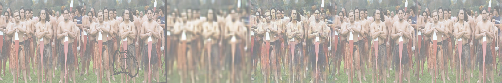

# CRA-Painting
Tensorflow2 Implementation of "Contextual Residual Aggregation for Ultra High-Resolution Image Inpainting" - 
CVPR 2020 Oral. This is an implementation guided by the following:
[GatedConvolutions](https://github.com/zhaoyuzhi/deepfillv2) - Baseline Gated Conv architecture
 w/ VGG16 Patch Discriminator & 
[ResidualPatchNet](https://github.com/wangyx240/High-Resolution-Image-Inpainting-GAN) - Attention / Residual Logic

### Requirements
```bash
pip3 install tensorflow==2.3.0 tensorflow-addons==0.11.2 opencv-python
```
Note `OpenCV` is only required for displaying images in `infer.py`

### Training
A handful of adjustable params can be found in train.py. Please 
use the argument parser to make any necessary changes. Training
on a large dataset such as Places365 is necessary. Either use
a pre-determined mask dataset, or generate a host of custom 
masks separately. Note that the model is trained on inputs
with a fixed size, however the generator can be called on
any sized input when inferring. 
```
python3 train.py
```
To generate a mask dataset, run the following instead.
Mask type can be selected from the following; `free_form` `bbox` `single_bbox`
```
python3 train.py --__gen_masks__ true --__mask_type__ bbox
```
The generator is a combination of gated convolutions and depthwise seperable convolutions,
alongside some attention & aggregation mechanisms from the original paper. This is aided
during training by a secondary network, the weights of which are from VGG16, acting almost
as a feature extractor helping optimise the loss. 
The discriminator utilises spectral (instance/batch) normalised convolutions. 

### Inference
This repository uses Tensorflow checkpoints, meaning to load the model
for inference, you will need to pass the directory containing your saved 
checkpoints, as such;
```
python3 infer.py --__gpath__ ./Examples/ModelA --__flist__ ./Data/Images --__mlist__ ./Data/Masks
```
If you don't have pre-existing masks, you can call the same `__gen_masks__` and `__mask_type__` flags
as before. 

### Results w/ Intermediate Representations. 



## Audio Implementation TBC

## Acknowledgements
I strongly reccommend reading the following paper, which explains in detail the mechanisms in play along with their purpose.
The following abstract gives a high level overview.

"Recently data-driven image inpainting methods have made inspiring progress, impacting fundamental image editing tasks such as object removal and damaged image repairing. These methods are more effective than classic approaches, however, due to memory limitations they can only handle low-resolution inputs, typically smaller than 1K. Meanwhile, the resolution of photos captured with mobile devices increases up to 8K. Naive up-sampling of the low-resolution inpainted result can merely yield a large yet blurry result. Whereas, adding a high-frequency residual image onto the large blurry image can generate a sharp result, rich in details and textures. Motivated by this, we propose a Contextual Residual Aggregation (CRA) mechanism that can produce high-frequency residuals for missing contents by weighted aggregating residuals from contextual patches, thus only requiring a low-resolution prediction from the network. Since convolutional layers of the neural network only need to operate on low-resolution inputs and outputs, the cost of memory and computing power is thus well suppressed."
```
@misc{yi2020contextual,
    title={Contextual Residual Aggregation for Ultra High-Resolution Image Inpainting},
    author={Zili Yi and Qiang Tang and Shekoofeh Azizi and Daesik Jang and Zhan Xu},
    year={2020},
    eprint={2005.09704},
    archivePrefix={arXiv},
    primaryClass={cs.CV}
}
```
